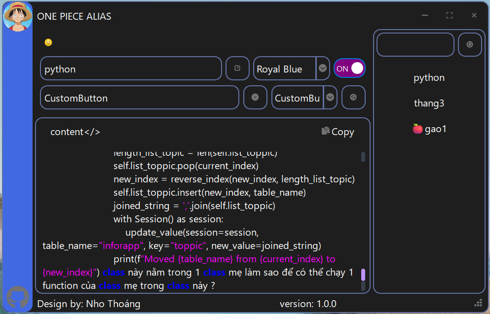
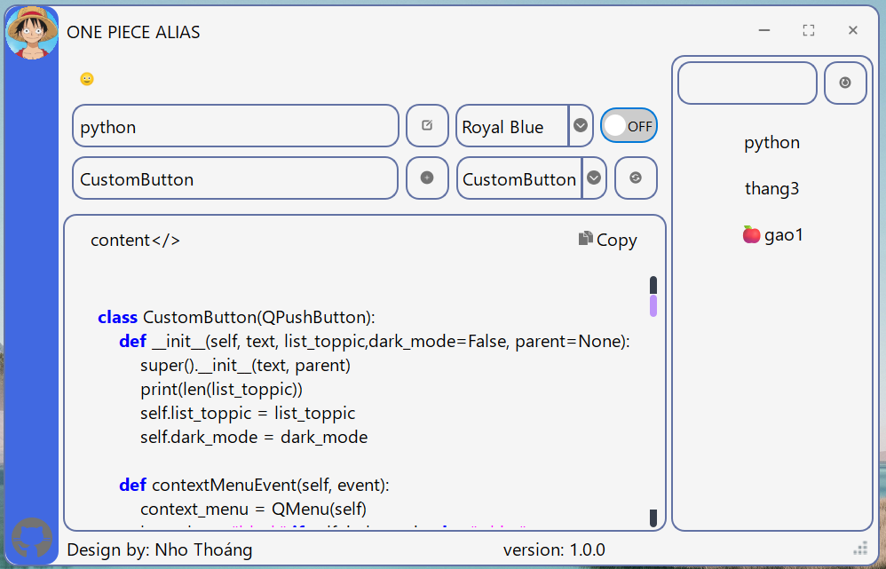
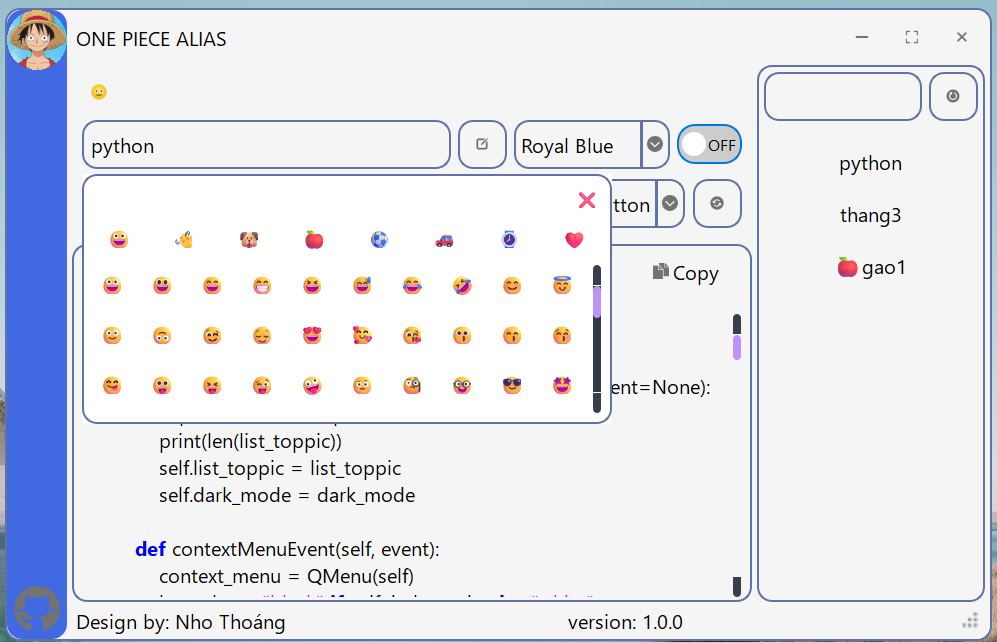
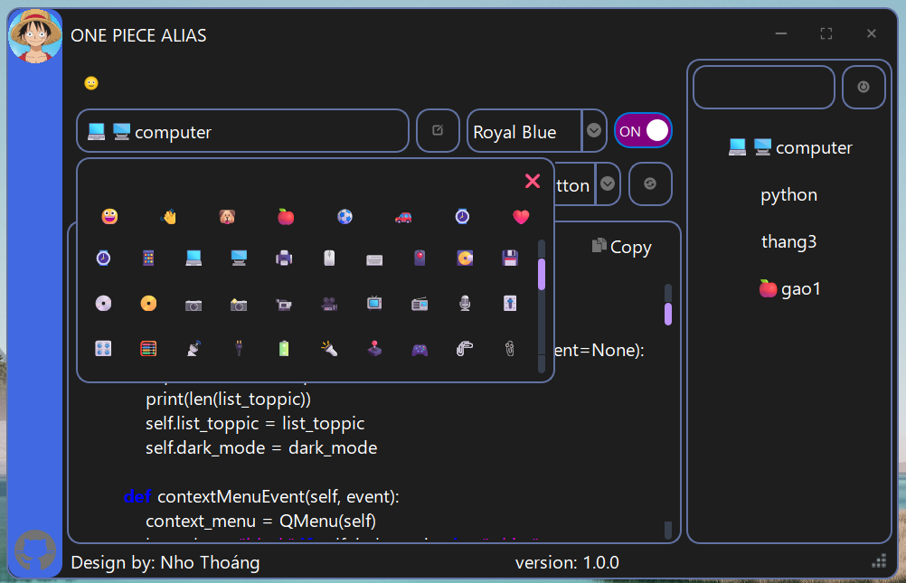

# ONE PIECE ALIAS  
**Phần mềm quản lý alias tiện ích**

ONE PIECE ALIAS là công cụ nhẹ, được thiết kế để giúp bạn quản lý alias một cách trực quan và linh hoạt. Mặc dù đây không phải là phần mềm thương mại, nhưng bạn cần thực hiện một số cấu hình đơn giản để tránh bị hệ thống diệt virus cảnh báo và xóa file.

---

## Mục lục
- [Yêu cầu hệ thống](#yêu-cầu-hệ-thống)
- [Hướng dẫn cấu hình Windows Defender](#hướng-dẫn-cấu-hình-windows-defender)
- [Tính năng phần mềm](#tính-năng-phần-mềm)
- [Hướng dẫn sử dụng](#hướng-dẫn-sử-dụng)
- [Hỗ trợ](#hỗ-trợ)

---

## Yêu cầu hệ thống

- **Hệ điều hành:** Windows 10 trở lên  
- **Yêu cầu bảo mật:** Cần thêm folder chứa phần mềm vào “Add an exclusion” của Windows Defender để tránh bị xóa file do nhận diện nhầm

---

## Hướng dẫn cấu hình Windows Defender

Để đảm bảo phần mềm chạy ổn định, hãy thêm folder chứa file của ONE PIECE ALIAS vào danh sách loại trừ của Windows Defender theo các bước sau:

1. Mở **Windows Security**
2. Chọn **Virus & Threat Protection**
3. Vào **Manage settings**
4. Cuộn xuống phần **Exclusions**
5. Chọn **Add or remove exclusions**
6. Chọn **Folder** chứa file phần mềm ONE PIECE ALIAS

  
  
  

---

## Tính năng phần mềm

- **Thay đổi giao diện:**
  - **Background:** Tự động thay đổi thành các màu trắng/đen tinh tế.
  - **Sidebar:** Cho phép thay đổi màu từ danh sách có sẵn trong combobox.

- **Quản lý alias thông minh:**
  - **Tạo Topic:** Tổ chức alias theo chủ đề để dễ quản lý. Bạn có thể tạo nhiều topic với alias có thể trùng nhau nếu thuộc cùng một chủ đề.
  - **Tùy chỉnh Topic:** Thực hiện **rename**, **di chuyển**, hoặc **xóa** topic thông qua menu chuột phải – dễ dàng và trực quan.
  - **Danh sách alias:** Khi chọn một topic, tất cả alias đã tạo sẽ được hiển thị trong combobox. Bạn có thể chọn trực tiếp hoặc sử dụng chức năng tìm kiếm để lọc alias liên quan.

- **Trợ giúp thao tác:**
  - **Tooltip:** Khi hover chuột vào các nút, tooltip hướng dẫn sử dụng sẽ hiện ra, giúp người dùng thao tác nhanh chóng.
  - **Button Create Topic:** Tạo mới một topic dễ dàng.
  - **Button Create or Update:** Tạo alias mới hoặc cập nhật alias hiện có tự động.
  - **Button Update Alias:** Cho phép thay đổi alias; sau khi nhập alias mới, phần mềm sẽ tự động xóa alias cũ và thêm alias mới vào danh sách.
  - **Button Copy:** Copy toàn bộ giá trị của alias một cách tiện lợi.

---

## Hướng dẫn sử dụng

1. **Khởi chạy phần mềm:**
   - Sau khi cài đặt, mở ONE PIECE ALIAS và thực hiện các cấu hình cơ bản nếu cần.

2. **Tạo và quản lý Topic:**
   - Bắt đầu bằng việc tạo một hoặc nhiều topic theo chủ đề liên quan.
   - Sử dụng menu chuột phải lên topic để đổi tên, di chuyển vị trí hoặc xóa topic không còn cần thiết.
   
3. **Quản lý alias:**
   - Sau khi topic được tạo, alias sẽ được liệt kê ở combobox.
   - Sử dụng chức năng tìm kiếm để lọc alias nhanh chóng theo từ khóa mong muốn.
   - Chọn alias cần thao tác và sử dụng các nút chức năng (Create/Update, Update, Copy) để quản lý alias theo ý muốn.

---

## Hỗ trợ

Nếu bạn gặp vấn đề hoặc có thắc mắc trong quá trình sử dụng ONE PIECE ALIAS, hãy liên hệ với nhóm phát triển để được hỗ trợ kịp thời.

---

ONE PIECE ALIAS được thiết kế nhằm tối ưu hóa thời gian và công sức của bạn trong việc quản lý alias. Chúc bạn có những trải nghiệm làm việc hiệu quả và thú vị với phần mềm!

---

*Lưu ý: Do đây là phần mềm không thương mại, một số phần mềm diệt virus có thể nhận diện nhầm. Hãy đảm bảo đã cấu hình Windows Defender theo hướng dẫn phía trên để tránh các sự cố không mong muốn.*
